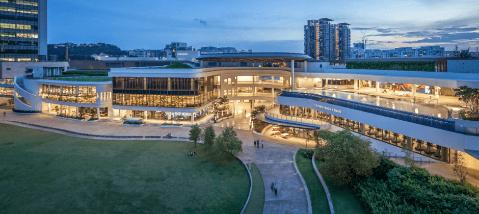
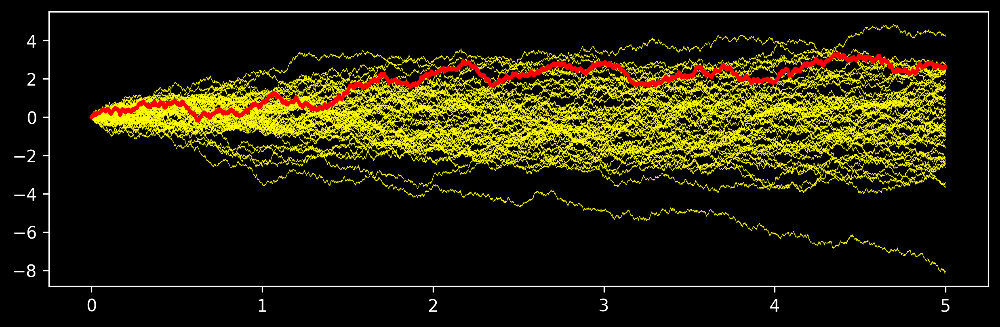
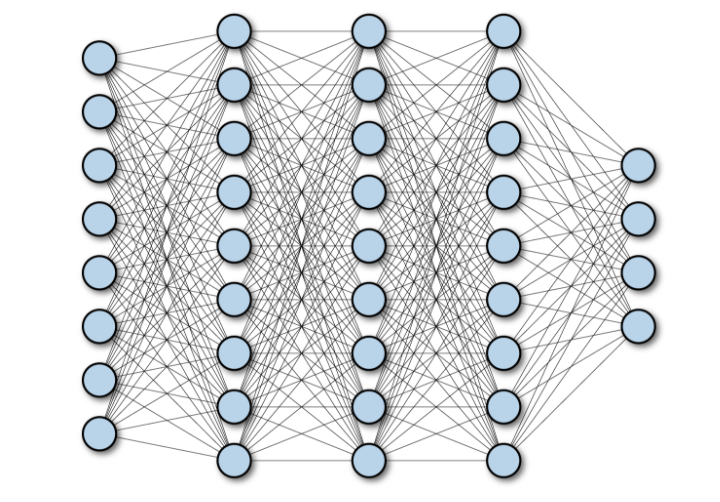

[//]: # INCLUDE LATEX MACROS



---

<div style="display: flex; align-items: center; justify-content: center; height: 100vh; flex-direction: column;">
  <p>Slides & Code</p>
  
  <p>[https://github.com/alexxthiery/viasm_2024](https://github.com/alexxthiery/viasm_2024)</p>
</div>

---

## PhD scholarships available....

* National University of Singapore PhD program in Statistics & Data Science
* A number of scholarships available
* Good weather & Good food & Good Maths ...
* Come have a chat if interested!

{.absolute bottom=0% left=10% width="80%"}


---

## 5 hours course: objectives

1. What are flows and diffusion models?
2. How to do basic manipulations with these models?
3. How to leverage these models for generative modeling?
4. How to use these models for statistical inference?

{.absolute bottom=0% left=15% height="50%"}


---

#### More generaly, why study diffusion processes?

* Natural generalization of Ordinary Differential Equation
* Very flexible and powerful modeling tools (finance, biology, physics, ...)
* Amenable to simulations and computations
* Establish links between PDEs and probability theory
* <span style='color:blue'>Many recent applications in Machine Learning & Generative Modeling</span>

{.absolute bottom=0% left=25% height="55%"}

---


### Some References on Diffusion Processes

* This course will focus a lot on intuition and heuristics
* This course will **not** be rigorous -- many good books for this!

{.absolute bottom=0% left=5% height="70%"}
{.absolute bottom=0% right=5% height="70%"}

---

### Ordinary Differential Equation (ODE)

* Consider a simple differential equation:

$$\frac{d}{dt} X_t = \mu(t, X_t)
\qquad \textrm{with} \qquad
X_0 = x_0
$$

* The function $\mu(t,x)$ is sometimes called the <span style='color:blue'>drift</span>.
* Solutions can be approximated with the <span style='color:blue'>Euler method</span>
* For time discretization $\delta \ll 1$, set $\widehat{X}_{0}=x_0$ and iterate

$$
\frac{\widehat{X}_{t+\delta} - \widehat{X}_{t}}{\delta} =  \mu(t, \widehat{X}_{t})
$$


which is the same as:

$$
\widehat{X}_{t+\delta} = \widehat{X}_{t} + \delta \, \mu(t, \widehat{X}_{t})
$$


---


* Discretized trajectory converges to the true trajectory as $\delta \to 0$

$$
\widehat{X}_{0}, \widehat{X}_{\delta}, \ldots, \widehat{X}_{k \delta}, \ldots
$$


{.absolute left="25%" width="50%"}

---

### Brownian Motion

* We would like to add noise to differential equations

$$\frac{d}{dt} X_t = \mu(t, X_t) + \color{blue}{\textrm{(noise)}}
$$

{.absolute bottom=0% left=5% height="50%"}
{.absolute bottom=0% right=5% height="50%"}

---


* Instead of a single trajectory, there is a distribution of trajectories

$$\frac{d}{dt} X_t = \mu(t, X_t) + \color{blue}{\textrm{(noise)}}
$$

{.absolute left="25%" width="50%"}


---

* We will write the differential equation with noise as

$$ dX_t = \mu(t, X_t) \, dt + \sigma \, \color{blue}{dW}
$$

* the coefficient $\sigma>0$ quantifies the "amount of noise"
* the noise increment is: $\color{blue}{dW = W_{t+dt} - W_t}$
* The stochastic process $\color{blue}{W_t}$ is a <span style='color:blue'>Brownian motion</span> or <span style='color:blue'>Wiener Process</span>

{.absolute bottom=0% left=5% height="45%"}
{.absolute bottom=0% right=5% height="45%"}


---

* A <span style='color:blue'>Brownian motion</span> in $\bbR^D$ is such that:
  * the increment $(W_{t+\delta} - W_{t})$ is independent of all the past up to time $t$
  * The increment $(W_{t+\delta} - W_{t})$ is <span style='color:blue'>Gaussian</span> with

$$\E[W_{t+\delta} - W_{t}] = 0 \in \bbR^D
\qquad \textrm{and} \qquad
\cov(W_{t+\delta} - W_{t}) = \red{\delta} \, I \in \bbR^{D,D}
$$

* It would not work to choose $\cov(W_{t+\delta} - W_{t}) = \red{\delta^{1+\epsilon}} \, I$ for $\delta \ll 1$
* A Brownian motion is often started at $W_0 = 0$
* Brownian trajectories are <span style='color:blue'>continuous</span> (not obvious from the definition)
* The transition probabilities are:

$$
\P(W_{t+\delta} \in dy \, | \, W_t = x) = \frac{1}{(2 \pi \delta)^{D/2}} \, \exp \left\{ -\frac{\| y-x \|^2}{2 \delta}\right\} \, dy
$$

---

Because of the Gaussian increments:

$$\E[W_{t+\delta} - W_{t}] = 0
\qquad \textrm{and} \qquad
\cov(W_{t+\delta} - W_{t}) = \delta \, I
$$

It is straightforward to simulate a Brownian trajectory. Set $W_0 = 0$ and iterate

$$W_{t+\delta} = W_t + \sqrt{\delta} \, \normal(0,I)$$

```{.python}
W = 0
W_trajectory = [W]
delta = 10**-3
T = 1
for k in range( int(1 / delta) ):
    W = W + np.sqrt(delta) * np.random.normal(0,1)
    W_trajectory.append(W)
```

{.absolute bottom=0% left=15% height="30%"}


---


#### Stochastic Differential Equation

* We would like to simulate from this <span style='color:blue'>stochastic differential equation (SDE)</span>
$$dX_t = \mu(t, X_t) \, dt + \color{green}{\sigma} \, \color{blue}{dW_t}$$

* We assume a known <span style='color:blue'>initial distribution $\pi_0(dx)$</span>

$$X_0 \sim \pi_0(dx)$$

* Imitate the standard Euler scheme: this is called the <span style='color:blue'>Euler-Maruyama scheme</span>

$$
\widehat{X}_{t+\delta} = \widehat{X}_t + \mu(t, \widehat{X}_t) \, \color{red}{\delta} + \color{red}{\sqrt{\delta}} \, \color{green}{\sigma} \, \normal(0,1)
$$

---

$$dX_t = - 5 \, \big( X_t - \sin(5t) \big) \, dt + \color{blue}{dW_t}$$

```{.python}
X = 0
X_trajectory = [X]
delta = 10**-3

T = 5
t = 0
t_trajectory = [t]

for k in range( int(T / delta) ):
    # update SDE
    t = t + delta
    X = X - 5*(W - np.sin(5*t))*delta + np.sqrt(delta) * np.random.normal(0,1)

    # save trajectory
    X_trajectory.append(X)
    t_trajectory.append(t)
```

{.absolute bottom=0% left=15% height="30%"}

---

### Ornstein Uhlenbeck (OU) Process

* One of the most important examples: simple, tractable and Gaussian

$$
dX_t = -\frac12 \, \frac{X_t}{\sigma^2} \, dt + dW
$$

* Unlike most SDEs, the exact transition probabilities are available

$$
X_{t + \delta} | (X_t=x) \; \sim \; \normal\BK{e^{-\delta/(2\sigma^2)} \, x, \sigma^2 \, (1 - e^{-\delta/\sigma^2}) \, I}
$$

* Setting $\color{blue}{\alpha = e^{-\delta/(2\sigma^2)}}$, this can be simulated as:

$$
X_{t + \delta} \; = \; \color{blue}{\alpha} \, x + \color{blue}{\sqrt{1-\alpha^2}} \, \normal(0, \sigma^2 \, I)
$$

* <span style='color:blue'>**Exercise**</span>: Invariant distribution:  $\color{blue}{ \pi(dx) = \normal(0, \sigma^2 \, I) }$


---

$$
X_{t + \delta} \; = \; \color{blue}{\alpha} \, x + \color{blue}{\sqrt{1-\alpha^2}} \, \normal(0, \sigma^2 \, I)
\qquad \textrm{with} \qquad
\color{blue}{\alpha = e^{-\delta/(2\sigma^2)}}
$$

```{.python code-line-numbers="13"}
X = 0
X_trajectory = [X]
delta = 10**-1

T = 10000
t = 0
t_trajectory = [t]

alpha = np.exp(-delta/2.)

for k in range( int(T / delta) ):
    t = t + delta
    X = alpha * X + np.sqrt(1-alpha**2) * np.random.normal(0,1)

    # save trajectory
    X_trajectory.append(X)
    t_trajectory.append(t)
```

{.absolute bottom=0% left=15% height="25%"}

---

### Langevin Diffusion

* Given a distribution $\color{blue}{\pi(dx)}$, we would like to construct a diffusion process $\{ X_t \}_{t \geq 0}$ that has $\color{blue}{\pi(dx)}$ as invariant distribution
   * If $X_t \sim \pi(dx)$ then $X_{T} \sim \pi(dx)$ for any $T \geq t$
   * Starting from any initial distribution, we have
$$X_t \; \stackrel{\mathcal{L}}{\longrightarrow} \; \pi(dx) \qquad \textrm{as} \qquad t \to \infty$$
* It is **extremely** useful for computing expectation with respect to $\pi(dx)$

:::: {.columns}

::: {.column #vcenter width="40%"}
{.absolute bottom=0% height="40%" left=10%}
:::

::: {.column #vcenter width="60%"}

* Langevin diffusion reads:

$$
dX_t \; = \; \blue{\frac{1}{2} \, \nabla \log \pi(X_t)} \, dt \, + \, dW
$$

* <span style='color:blue'>**Exercise:**</span> What if $\pi = \normal(\mu, \Gamma)$ ?

:::
::::

---

#### Accelerating a Diffusion

* Consider a diffusion $\blue{dX_t = \mu(t, X_t) \, dt + \sigma \, dW}$

* It is often useful to accelerate/decelerate the diffusion by a factor $\alpha \geq 0$,

$$
X^{\alpha}_t \equiv X_{\alpha t}
$$

* The accelerated process satisfies

$$
dX^{\alpha}_t = \red{\alpha} \, \mu(t, X^{\alpha}_t) \, dt + \red{\sqrt{\alpha}} \, \sigma \, dW
$$

* Different flavours of Langevin diffusions: they are all the same...

$$
\begin{align}
dX_t &\; = \; \frac{1}{2} \, \nabla \log \pi(X_t) \, dt \, + \, dW\\
dX_t &\; = \; \nabla \log \pi(X_t) \, dt \, + \, \sqrt{2} \, dW\\
dX_t &\; = \; \frac{\sigma^2}{2} \, \nabla \log \pi(X_t) \, dt \, + \, \sigma \, dW\\
\end{align}
$$

---

$$
dX_t \; = \; \color{blue}{\frac{1}{2} \, \nabla \log \pi(X_t)} \, dt \, + \, dW
$$

```{.python code-line-numbers="11"}
X = 0.
X_trajectory = [X]
delta = 10**-1

T = 3000
t = 0
t_trajectory = [t]

for k in range( int(T / delta) ):
    t = t + delta
    X = X + 0.5*grad_log_pi(X)*delta + np.sqrt(delta) * np.random.normal(0,1)

    # save trajectory
    X_trajectory.append(X.item())
    t_trajectory.append(t)
```

{.absolute bottom=0% left=5% height="30%"}

---

### Computing Bayesian Posterior Estimates

* Bayesian Framework: Prior + Likelihood $\longrightarrow$ Posterior 

$$\color{red}{\pi_{\text{post}}(x)} = \frac{1}{\cZ} \color{blue}{\bar{\pi}(x)}$$

* For some functions $\phi: \bbR^D \to \bbR$, we would like to compute 

$$\E_{\color{red}{\pi_{\text{post}}}}[\phi(X)]$$

* Because $\nabla \log \color{red}{\pi_{\text{post}}} = \nabla \log \color{blue}{\bar{\pi}}$  one can simulate the Langevin diffusion

$$
dX_t \; = \; \frac{1}{2} \nabla \log \color{blue}{\bar{\pi}(X_t)} \, dt + dW
$$

* This Langevin diffusion will converge exactly towards the posterior $\color{red}{\pi_{\text{post}}}$

---

:::: {.columns}
::: {.column #vcenter width="60%"}
* How would you compute the mean and variance of this unormalized distribution?
$$
\pi(x) = \frac{1}{\cZ} \exp\left\{ -\frac{x^2 + \sin(5 + 5 \, x)}{2}\right\}
$$
:::
::: {.column #vcenter width="30%"}
{.absolute top=0% height="30%" right=5%}
:::
::::


---

:::: {.columns}
::: {.column #vcenter width="60%"}
* How would you compute the mean and variance of this unormalized distribution?
$$
\pi(x) = \frac{1}{\cZ} \exp\left\{ -\frac{x^2 + \sin(5 + 5 \, x)}{2}\right\}
$$
:::
::: {.column #vcenter width="30%"}
{.absolute top=0% height="30%" right=5%}
:::
::::

* Run a Langevin diffusion and average at the end:

```{.python}
# Define log-probability
def log_pi(x):
    return -0.5 * (x**2 + jnp.sin(5 + 5*x))

# automatic differentiation!
grad_log_pi = jax.grad(log_pi)

### Define other params as before

for k in range( int(T / delta) ):
    X = X + 0.5*grad_log_pi(X)*delta + np.sqrt(delta) * np.random.normal(0,1)    
    X_trajectory.append(X.item())

# compute mean/variance estimates
mean_hat = np.mean(X_trajectory)
var_hat = np.std(X_trajectory)**2
```

---


* We implicitly used a <span style='color:blue'>Law of Large Numbers for Ergodic Processes</span>: if $X_t$ is a process that converges in laws to a distribution $\pi(dx)$, under some ergodicity conditions, we have:

$$
\underbrace{\int_{\bbR^D} \phi(x) \, \pi(dx)}_{\color{blue}{\text{Spatial Average}} } 
\qquad = \qquad 
\underbrace{\lim_{T \to \infty} \quad \frac{1}{T}\int_{0}^T \phi(X_t) \, dt}_{\color{blue}{\text{Temporal Average}} } 
$$

{.absolute bottom=0% height=50% left=5%}

---

### Other approaches?

* Computing $\E_{\pi_{\post}}[\phi(X)]$ is a fundamental problem in Bayesian statistics

* <span style='color:blue'>Discretize</span> the integral $\int \phi(x) \, \pi_{\post}(dx)$

* If one knows how to <span style='color:blue'>simulate</span> from $\pi_{\post}$ then
$$
\frac{1}{N} \curBK{\phi(X_1) + \ldots + \phi(X_N)} \to \E_{\pi_{\post}}[\phi(X)]
$$
  * Rejection sampling
  * Inversion methods
  * Tricks...

* <span style='color:blue'>Importance-Sampling (IS):</span> use an auxiliary distribution $q$ and the remark

$$
\E_{\pi_{\post}}[\phi(X)] = \E_{\blue{q}}\sqBK{ \phi(X) \, \curBK{ \frac{\pi_{\post}(X)}{\blue{q(X)} } } }
$$

* <span style='color:blue'>**Exercise**</span>: how to use IS if $\pi_{\post}$ is only known up to a normalization constant?


---

### Taylor Expansion and Ito Calculus

* In high-school, we learned  that

$$F(b) - F(a) = \int_{a}^{b} F'(t) \, dt$$

* Similarly, if $X_t$ follows the differential equation $\color{blue}{\frac{d}{dt} X_t = \mu(t,X_t)}$ then:
$$
\frac{d}{dt} F(t, X_t) = \partial_t F(t, X_t) + \partial_x F(t,X_t) \, \mu(t, X_t)
$$

* In order to manipulate diffusions, we need to be able to do similar computations but with:

$$\color{blue}{dX_t = \mu(t,X_t)\, dt + \sigma \, dW}.$$

---

### $2$nd order Taylor expansion is all you need!

* Consider a smooth function $F: \bbR^d \to \bbR$ and a diffusion $\color{blue}{dX_t = \mu(t,X_t)\, dt + \sigma \, dW}$:

$$
F(X_{t+\delta}) 
\quad \approx \quad 
F(X_{t}) 
\quad + \quad
\color{blue}{ (\cL F)(t, X_t)} \, \color{red}{\delta}
\quad + \quad
\underbrace{\textrm{(Noise of order $\color{red}{\delta^{1/2}}$)}}_{\text{Mean zero}}
$$

* The quantity $\color{blue}{ (\cL F)(t,X_t)}$ is called the <span style='color:blue'>Generator of the diffusion:</span>

$$
\begin{aligned}
\cL F(t,x) &\quad = \quad \mu(t,x) \, F'(x) \quad + \quad \frac{\sigma^2}{2} \, F''(x)\\
\cL F(t,x) &\quad = \quad \mu(t,x) \, \nabla F(x) \quad + \quad \frac{\sigma^2}{2} \, \Delta F(x)
\end{aligned}
$$

* Slightly more rigorously, we have

$$
\E[F(X_{t+\delta}) \, | \, X_t = x]
\quad = \quad
F(x) \quad + \quad
\cL F(t,x) \, \delta \quad + \quad \color{green}{o(\delta)}
$$
---

#### Fokker-Planck Equation

* Suppose that $\color{blue}{dX_t = \mu(t,X_t)\, dt + \sigma \, dW}$ starts from $X_0 \sim \pi_0(dx)$, what is $\pi_t(dx)$ ?

* Take an arbitrary test function $\phi: \bbR^d \to \bbR$

$$
\begin{aligned}
\E_{X \sim \pi_{t+\delta}}[\phi(X)] 
&=
\E_{X_t \sim \pi_{t}}[\phi(X_{t+\delta})] 
\approx
\E_{X_t \sim \pi_{t}}[\phi(X_t) + \cL \phi(X_t) \, \delta] 
\end{aligned}
$$

* Integration by parts gives the Fokker-Planck eqquation: $\color{blue}{\partial_t \pi_t =  \cL^{\star} \pi}$,

$$
\begin{aligned}
\partial_t \pi_t
&\quad = \quad -\nabla \cdot (\mu \pi_t) + \frac{\sigma^2}{2} \, \Delta \pi_t
\end{aligned}
$$

{.absolute bottom=0% left=30% height="35%"}
{.absolute bottom=0% right=30% height="35%"}


---

:::: {.columns}

::: {.column width="60%"}

* Consider the Langevin diffusion:

$$
dX_t = \frac12 \, \nabla \log \pi(X_t) \, dt + dW
$$

:::


::: {.column width="40%"}

{width=70%}

:::

::::

* Initial distribution $X_0 \sim \pi_0$ very different from the stationary distribution

$$
\color{blue}{
\partial_t \pi_t
\quad = \quad -\nabla \cdot (\mu \pi_t) + \frac{\sigma^2}{2} \, \Delta \pi_t
}
$$


{.absolute bottom=0% height=35% left=27%}

---

### Mixture of three 2D Gaussians

$$
\color{blue}{
\partial_t \pi_t
\quad = \quad -\nabla \cdot (\mu \pi_t) + \frac{\sigma^2}{2} \, \Delta \pi_t
}
$$

{.absolute bottom=0% height=70% left=7%}

---

### Kullback-Leibler divergence

* For two probability distributions $p(dx)$ and $q(dx)$

$$
\kl(p, q) \; = \; \int p(x) \, \log \curBK{ \frac{p(x)}{q(dx)} }\, dx \quad \geq 0.
$$

* Note that in general $\kl(p, q) \neq \kl(q, p)$
* This notion of discrepancy very naturally occurs in information theory, statistical mechanics, large deviations
* Often use in variational inference: the minimization

$$
\lambda_\star \; = \; \argmin_\lambda \; \kl(p_{\lambda}, \pi)
$$

* variational inference can be implemented even if $\pi(x) = \frac{\bar{\pi}(x)}{\cZ}$ is only known up to a normalization constant

---

### Langevin: convergence to equilibrium

* The diffusion $\color{blue}{dX_t = \frac{1}{2} \, \nabla \log \pi(X_t) \, dt + dW}$ lets the distribution $\pi(dx)$ invariant
   * Proof: Fokker-Planck

* The diffusion $\color{blue}{dX_t = \frac{1}{2} \, \nabla \log \pi(X_t) \, dt + dW}$ converges towards $\pi(dx)$
   * Call $p_t$ the distribution of $X_t$ 
   * Fokker-Planck + Algebra gives

$$
\frac{d}{dt} \kl\BK{p_t, \pi}
\; = \;
- \int p_t(x) \, \left\| \nabla \log \frac{p_t(x)}{\pi(x)}\right\|^2 \, dx \leq 0
$$

---

### Langevin: convergence to equilibrium

$$
\frac{d}{dt} \kl\BK{p_t, \pi}
\; = \;
- \int p_t(x) \, \left\| \nabla \log \frac{p_t(x)}{\pi(x)}\right\|^2 \, dx \leq 0
$$

* One knows that $\kl\BK{p_t, \pi}$ is non-increasing: but does it converge?

* For a relatively wide-class of distributions $\pi$ one can establish a <span style='color:blue'>logarithmic Sobolev inequality</span>: there is $\color{red}{\tau} > 0$ such that for "any" distribution $\rho(dx)$

$$
\kl(\rho, \pi) \leq \color{red}{ \tau} \;
\int \rho(x) \, \left\| \nabla \log \frac{\rho(x)}{\pi(x)}\right\|^2 \, dx
$$

* If $\pi$ satisfies a Log-Sobolev Inequality with constant $\tau > 0$ it follows that $\frac{d}{dt} \kl\BK{p_t, \pi} \leq -(1/\tau) \, \kl\BK{p_t, \pi}$ and [Gronwall Lemma](https://en.wikipedia.org/wiki/Grönwall%27s_inequality) gives fast convergence:

$$
\kl\BK{p_t, \pi} \leq \color{blue}{\exp\curBK{-\frac{t}{\tau}}} \, \kl\BK{p_0, \pi}
$$


---

### Log Sobolev Inequalities (LSI)

$$
\kl(\rho, \pi) \leq \color{red}{ \tau}
\int \rho(x) \, \left\| \nabla \log \frac{\rho(x)}{\pi(x)}\right\|^2 \, dx
$$

* if the ratio $\frac{\rho(x)}{\pi(x)} \approx \textrm{const}$ then distributions $\rho(dx)$ and $\pi(dx)$ are close to each other

* **Log-Concavity**: if $\color{blue}{-\hess\BK{ \log \pi } \geq \epsilon I}$ then a LSI holds

* **Perturbation**: if $\pi(dx)$ satisfies a LSI and $\Phi:\bbR^d \to \bbR$ is continuous and bounded, the perturbed distributon $\pi_{\textrm{perturbed}}(x)$ also satisfies a LSI

$$
\pi_{\textrm{perturbed}}(x) \; \propto \; e^{\Phi(x)} \, \pi(x)
$$

* the concept of LSI was created by [Leonard Gross in 1975](https://en.wikipedia.org/wiki/Leonard_Gross)

{.absolute bottom=0% height=40% right=0%}

---

### Generative Model: Goals

* Given a large set of samples $\{ x_i \}_{i=1}^N \subset \bbR^D$, generate "similar looking" samples?
* Generate new samples conditioned on some constraint?
* Fit a probabilistic model to it?

#### Why would we want to do this?

* (necessitate) understand the dataset better
* Dimension reduction
* Design good prior distributions from data

{.absolute bottom=0% height=35% left=20%}

---

### Denoising Diffusion Probabilistic Models

* $N$ samples $\cD \equiv \{x_i\}_{i=1}^N$ in $\bbR^D$ from an unknown data distribution $\pi_{\data}(dx)$

* <span style='color:blue'>Noising diffusion</span> $\{ X_t \}_{t=0}^T$ that:
  * starts from the data distribution: $\blue{X_0 \sim p_0(dx) \equiv \pi_{\data}(dx)}$
  * ends (close to) at reference distribution: $\blue{X_T \sim p_T(dx) \equiv \pi_{\ref}(dx)}$

* Typically $\pi_{\ref}(dx) \sim \normal(0,I)$ and the <span style='color:blue'> noising diffusion is a OU</span>

* We would like to build the <span style='color:blue'>reverse diffusion</span>!

{.absolute bottom=0% height=45% left=20%}


---

### Noising OU process

$$
dX_t = - \frac12 X_t \, dt + dW
\qquad \textrm{started at} \qquad
X_0 \sim \pi_{\data}(dx)
$$

* Quickly converges towards $\pi_{\ref} = \normal(0,I)$
* Simple transition densities: the <span style='color:blue'>law of $X_{t+s}$ given that $X_t = x_t$</span> is 
$$
X_{t+s} | (X_t=x_t) \; \stackrel{\mathcal{L}}{=} \;\alpha_s x_t + \sigma_s \, \bfn \qquad \text{with} \qquad
\left\{
\begin{aligned}
\alpha_s &= \sqrt{1-\sigma_s^2}\\
\sigma^2_s &= 1-e^{-s}
\end{aligned}
\right.
$$
for isotropic Gaussian noise term $\bfn \sim \pi_{\ref} = \normal(0,I)$. 

* The distribution at time $0 \leq t \leq T$ is denoted as

$$
\blue{ X_t \sim p_t(dx) }
$$

---

### How to reverse a diffusion?

* Consider a (forward) diffusion $\blue{dX_t = \mu(X_t) \, dt + \sigma \, dW}$ for $0 \leq t \leq T$
* Define the <span style='color:blue'>reverse diffusion</span> $\blue{X^{\rev}_s}$ as:

$$X^{\rev}_s = X_{T-s}.$$

* Since $X^{\rev}_s$ runs backward in time, we have

$$
X^{\rev}_0 \sim p_T(dx)
\qquad \textrm{and} \qquad
X^{\rev}_0 \sim p_0(dx)
$$

* The reverse diffusion is given by:

$$
dX^{\rev}_s = -\mu(X^{\rev}_s) \, ds \; + \red{ \sigma^2 \, \nabla \log p_{T-s}(X^{\rev}_s) \, ds} \; + \; \sigma \, dB.
$$

* <span style='color:blue'>**Exercise:**</span> What is the reverse of the reverse of $\blue{dX = \mu(X) \, dt + \sigma \, dW}$ ?
---

### Intuition for the reverse dynamics


* Consider $\blue{dX = \mu(X) \, dt + \sigma \, dW}$ and a "naive" (and wrong) reverse process

$$dX = \red{-}\mu(X) \, dt + \sigma \, dB$$

* The term $\red{ \sigma^2 \, \nabla \log p_{T-s}(X^{\rev}_s) \, ds}$ pushes the reverse diffusion in the "right direction", i.e. parts of the state space where $p_{T-s}$ is large


{.absolute bottom=0% height=40% left=5%}

---

### Interlude: Tweedie formula

* Consider a Brownian motion $dX_t = \sigma \, dW$ started from $X_0 \sim p_0(dx)$

* We now know that the reverse dynamics is

$$
dX^{\rev}_s = \red{ \sigma^2 \, \nabla \log p_{T-s}(X^{\rev}_s) \, ds} \; + \; \sigma \, dB.
$$

* Now, suppose that one collects $y = X_0 + \normal(0, \sigma^2 \, \delta)$ with $X \sim p_0(dx)$, the reverse dynamics suggests

$$
\E[X_0 | y] \; \approx \; y + \sigma^2 \, \delta \, \nabla \log p_\delta(y)
$$

* Maurice Tweedie (1919–1996) noticed that it is in fact an equality!

$$
\E[X_0 | y] \; \red{=} \; y + \sigma^2 \, \delta \, \nabla \log p_\delta(y)
$$

---

### Score $\cS(t,x) = \nabla_x \log p_t(x)$

* We chose a OU as noising process: $\blue{dX_t = - \frac12 X_t \, dt + dW}$ with $X_0 \sim \pi_{\data}(dx)$

* The reverse dynamics reads

$$
dX^{\rev}_s = \frac12 \, X^{\rev}_s \, ds \; + \red{ \nabla \log p_{T-s}(X^{\rev}_s) \, ds} \; + \;  \, dB.
$$

* Unfortunately, we do not know $\red{\cS(t,x) = \nabla_x \log p_t(x)}$

* $\red{\cS(t,x)}$ is called <span style='color:blue'>the score</span>: if we knew the score, we could simulate the diffusion backward!

* A number of ML techniques to evaluate the score $\red{\cS(t,x)}$ from data, i.e. how to estimate the gradient of the density if we have a lot of samples from this density. We will concentrate on "denoising score matching"

* **Remark:** in Statistics, the "score" often refers to $\nabla_{\red{\theta}} \log p_{\theta}(x)$, careful!

---

### Score matching

* Score Matching is another approach to estimate the score from data
* It can be more difficult to "scale" to higher-dimensional examples
* A number of attempts to scale this approach and can sometimes work very well
* Recommended reading:

{.absolute bottom=0% height=50% left=15%}


---

### Score estimation

* We need to build an approximation of the score,

$$\cS(t,x) \; \approx \; \nabla_x \log p_t(x).$$

* $\cS(t,x)$ is often parametrized by a **neural network**, although any parametric function approximator could be used

* Since the transition probabilities of OU are tractable, we have
$$
\begin{align}
\log p_t(x) &= \log \int \; F_{\text{OU}}(t, x_0, x)\; \pi_{\data}(d x_0)\\
&\qquad \textrm{ }\\
&\qquad \textrm{where}\\
&\qquad \textrm{ }\\
F_{\text{OU}}(t, x_0, x) &= \P(X_t \in dx \, | \, X_0 = x_0)
\end{align}
$$

---

### From sampling to denoising

* Since $F(t, x_0, x)$ is tractable, algebra gives
$$
\nabla_x \log p_t(x) \; = \; -\frac{x - \alpha_t \, \red{\widehat{x}_0(t,x)} }{\sigma_t^2}
$$
where $\widehat{x}_0(t,x)$ is a "denoising" estimate of the initial position $x_0$ given a noisy estimate $X_t=x$ at time $t$:
$$
\red{ \widehat{x}_0(t,x) \; = \; \E[X_0  \; \mid \; X_t = x].}
$$

* To estimate the score, we need to build a <span style='color:blue'>denoiser</span>


$$
\widehat{x}_0(\cdots): [0,T] \times \bbR^d \to \bbR^d.
$$

* Building $\widehat{x}_0(t,x)$ is a "simple" <span style='color:blue'>regression problem</span>. In summary, we have transformed the problem of generating samples into a regression problem!

---

### Regressions...

* <span style='color:blue'>**Exercise 1:**</span> given a pair of random variables $(X,Y) \in \bbR^{d_X} \times \bbR^{d_Y}$, what is the function $\cD_\star:\bbR^{d_Y} \to \bbR^{d_X}$ that minimizes

$$\E\BK{\|X - \cD(Y)\|^2} \qquad ?$$

* <span style='color:blue'>**Exercise 2:**</span> Suppose one can generate as many realizations $(x_i, y_i)$ on the random variable $(X,Y)$: How can one construct at approximation of the function $\cD_{\star}$ ?

{.absolute bottom=0% height=40% left=30%}


---

### Building the denoiser

$$
\blue{ \widehat{x}_0(t,x) \; = \; \E[X_0  \; \mid \; X_t = x].}
$$

* One can easily simulate from $(X_0, X_t)$:

$$
x_0 \sim \pi_{\data}(dx)
\qquad \and \qquad
x_t = \alpha_t \, x_0 + \sigma_t \, \bfn
$$

* Parametrize $\widehat{x}_0(t,x)$ with a neural-net with <span style='color:red'>weight $\omega$</span> and minimize:

$$
\cL( \red{\omega} ) \equiv \E \curBK{ \left\| X_0 - \widehat{x}_0(\tau, X_{\tau}) \right\|^2}
$$


---

### Neural Net architecture

$$
\blue{ \widehat{x}_0(t,x) \; = \; \E[X_0  \; \mid \; X_t = x].}
$$

* Function of $(x,t)$

* Can be useful to include "Fourier features"

* For images, convolutional layers, etc...

{.absolute bottom=0% height=40% left=30%}


---

* The score is then defined as

$$
\cS(t,x) \; = \; -\frac{x - \alpha_t \, \widehat{x}_0(t,x)}{\sigma^2_t}
\; = \; 
\nabla \log p_t(x)
$$

* the reverse dynamics reads:

$$
dX^{\rev}_s = \frac12 \, X^{\rev}_s \, ds \; + \red{ \cS(T-s, X^{\rev}_s) \, ds} \; + \;  \, dB.
$$

{.absolute bottom=0% height=45% left=25%}

---

### The ODE-Diffusion trick

* Diffusion $\blue{dX = \mu(t,X) \, dt + dB}$ with marginal $X_t \sim p_t$

$$
\partial_t p_t = -\nabla( p_t \, \mu) + \frac12 \, \Delta p_t
$$

* Differential Equation $\blue{dX^{\textrm{ODE}}_t = F(t,X^{\textrm{ODE}}_t) \, dt}$ with marginal $X^{\textrm{ODE}}_t \sim p^{\textrm{ODE}}_t$

$$
\partial_t p^{\textrm{ODE}}_t = -\nabla( p^{\textrm{ODE}}_t \, F).
$$

* Can one find a vector field $F(t,x)$ such that

$$
p_t(x) = p_t^{\text{ODE}}(x)
\qquad \textrm{for all times?}
$$

* Yes! It suffices to take:

$$
\red{F(t,x) = \mu(t,x)  - \frac12 \, \nabla_x \log p_t(x)}
$$

---

### ODE-Diffusion trick: illustration

* Brownian motion dynamics: $$\blue{dX = dW}$$

* ODE with same marginals

$$\red{dX^{\text{ODE}}_t = \frac12 \, \frac{X^{\text{ODE}}_t}{2} \, dt}$$

{.absolute bottom=0% height=40% left=15%}


---

#### Noising diffusion, reverse diffusion, reverse ODE...

$$
\red{F(t,x) = \mu(t,x)  - \frac12 \, \nabla_x \log p_t(x)}
$$

* Noising OU process: 

$$\blue{dX_t = -\frac12 \, X_t \, dt \, + \, dW}$$

* Reverse Diffusion: 

$$\blue{dX^{\rev}_s = \frac12 \, X^{\rev}_s \, ds \; + \nabla \log p_{T-s}(X^{\rev}_s) \, ds \; + \;  \, dB}$$

* Reverse ODE:

$$\blue{dX^{\rev}_s = \frac12 \, X^{\rev}_s \, ds \; + \red{\frac12} \, \nabla \log p_{T-s}(X^{\rev}_s) \, ds }$$

---

* Reverse ODE:

$$\blue{dX^{\rev}_s = \frac12 \, X^{\rev}_s \, ds \; + \red{\frac12} \, \nabla \log p_{T-s}(X^{\rev}_s) \, ds }$$

{.absolute bottom=0% height=70% left=5%}

---

* Reverse ODE:

$$\blue{dX^{\rev}_s = \frac12 \, X^{\rev}_s \, ds \; + \red{\frac12} \, \nabla \log p_{T-s}(X^{\rev}_s) \, ds }$$

{.absolute bottom=0% height=70% left=15%}

---


### Bayesian Inverse Problems

* $X \in \bbR^{D_x}$ an object of interest

* $Y \in \bbR^{D_y}$ an incomplete, possibly non-linear and noisy measurement

$$
\blue{Y = \Phi(X) \; + \; \textrm{(noise)}}
$$

* Applications are numerous:
   * image denoising (medical imaging, astronomy)
   * image inpainting: reconstruct parts of an image
   * reconstruction of temperature / pressure field
   * localization from noisy observations (radar, sonar, oil prospection)

---

{.absolute bottom=0% height=80% left=10%}

---

{.absolute bottom=0% height=70% left=5%}


---

### Bayesian Inverse Problems

$$
\blue{Y = \Phi(X) \; + \; \textrm{(noise)}}
$$

* Summarize a-priori knowledge/constraints with a prior distribution 
$$\blue{\pi_{\prior}(dx)}$$

* Noisy measurement likelihood:
$$\blue{\cL_y(x) = \P(y \, | x)}$$

* Posterior distribution: what we know about $x$ after observing $y$

$$\blue{\pi_{\post}(x) \; = \; \frac{1}{\cZ} \, \pi_{\prior}(x) \, \cL_y(x)}$$

---

### Typical Scenario

$$
\blue{Y = \Phi(X) \; + \; \normal(0,\Gamma)}
$$

* In Bayesian inverse problems, standard choice of priors include:
  * Gaussian-type priors $\pi_{\prior}(x) \propto \exp\curBK{ -\frac{1}{2} \, \| F x \|^2}$
  * Total-Variatation-type prior $\pi_{\prior}(x) \propto \exp\curBK{ -\lambda \, \| F x \|_{L^1}}$

* Additive Gaussian noise:

$$
\cL(X) = \frac{1}{(2\pi)^{D/2} \det(\Gamma)^{1/2}} \, \exp\curBK{-\frac12 \, \|Y - \Phi(X)\|_{\Gamma^{-1}}^2}
$$

* Posterior distribution

$$
\pi_{\post}(x) \; = \; 
\frac{1}{\cZ} \, \exp \curBK{-\frac12 \, \|Y - \Phi(X)\|_{\Gamma^{-1}}^2 -\lambda \, \| F x \|_{L^1} }
$$

---

### Possible approaches

$$\blue{\pi_{\post}(x) \; = \; \frac{1}{\cZ} \, \pi_{\prior}(x) \, \cL_y(x)}$$

* Maximum A Posteriori:

$$
x_{\map} \; = \; \argmax_{x} \pi_{\post}(x) \; = \; \argmax_{x} \log \pi_{\prior}(x) + \log \cL_y(x)
$$

* Markov Chain Monte Carlo: 

$$\text{Run a Markov Chain that explores $\pi_{\post}(dx)$ } $$

* Variational Methods:

$$\lambda \; = \; \argmin_{\lambda} \; \kl\BK{p_{\lambda}, \pi_{\post}}$$


---

### How to design a prior distribution?

{.absolute bottom=0% height=80% left=20%}

---

### How to design a prior distribution?

{.absolute bottom=0% height=80% left=20%}

---

### How to design a prior distribution?

{.absolute bottom=0% height=80% left=20%}

---

### How to design a prior distribution?

{.absolute bottom=0% height=80% left=20%}


---

### How to design a prior distribution?

{.absolute bottom=0% height=80% left=20%}

---

### Use large datasets!

{.absolute bottom=0% height=80% left=3%}

---

### Posterior sampling with diffusions

* From a large dataset and its empirical distribution $\pi_{\data}(dx)$, one knows how to generate samples approximately distributed according to it

$$
dX^{\rev}_s = \frac12 \, X^{\rev}_s \, ds \; + \red{ \nabla \log p_{T-s}(X^{\rev}_s) \, ds} \; + \;  \, dB.
$$

* Recall that <span style='color:blue'>$p_t(x)$ is obtained by diffusing $p_0 \equiv \pi_{\data}$ on $[0;t]$.</span>

* How to generate samples **conditioned** on an observation $Y$ In other words, assume a noisy observation $Y$ such as
$$Y = \Phi(X) + \text{(noise)}$$
and assume a (smoothed version) of $\pi_{\data}$ is used as prior: How to simulate from the posterior

$$
\pi_{\post}(x) \; = \; \frac{1}{\cZ} \, \pi_{\data}(x) \, \P(y | x)
$$


---

* We could use a reverse diffusion

$$
dX^{\rev}_s = \frac12 \, X^{\rev}_s \, ds \; + \red{ \nabla \log p_{T-s}(X^{\rev}_s | Y) \, ds} \; + \;  \, dB.
$$

* Distribution $p_t(x_t | Y)$ is obtained by diffusing $\pi_{\post}(dx)$ on $[0;t]$

* We have

$$
\begin{align}
p_t(x_t | Y) = \frac{ p_t(x_t) \, \P(Y \, | x_t) }{ \P(Y) }
\end{align}
$$

* It follows that

$$
\nabla \log p_t(x_t | Y) = \nabla \log p_t(x_t) 
\; + \;
\blue{ \nabla \log \P(Y \, | x_t) }
$$

* The following approximation is often used:

$$
\begin{align}
\P(Y \, | x_t) 
&=
\int \P(Y, x_0 \, | x_t) \, dx_0
=
\int \P(Y | x_0) \, \P( x_0 \, | x_t) \, dx_0 \\
& \approx \P(\, Y | \widehat{x}_0(x_t) \,)
\end{align}
$$

---

$$
dX^{\rev}_s = \frac12 \, X^{\rev}_s \, ds \; + \red{ \nabla \log p_{T-s}(X^{\rev}_s) \, ds} \; + \;  \blue{\nabla \log \P(\, Y | \widehat{x}_0(x_t) \,)} \, + dB.
$$

{.absolute bottom=0% height=70% left=25%}

